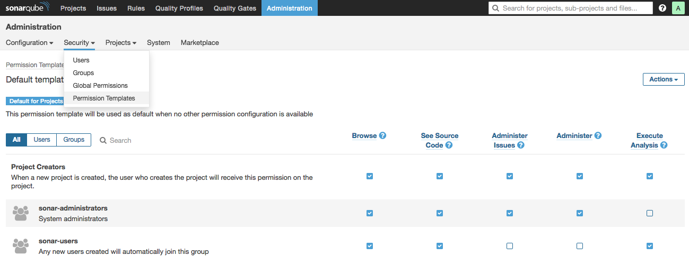
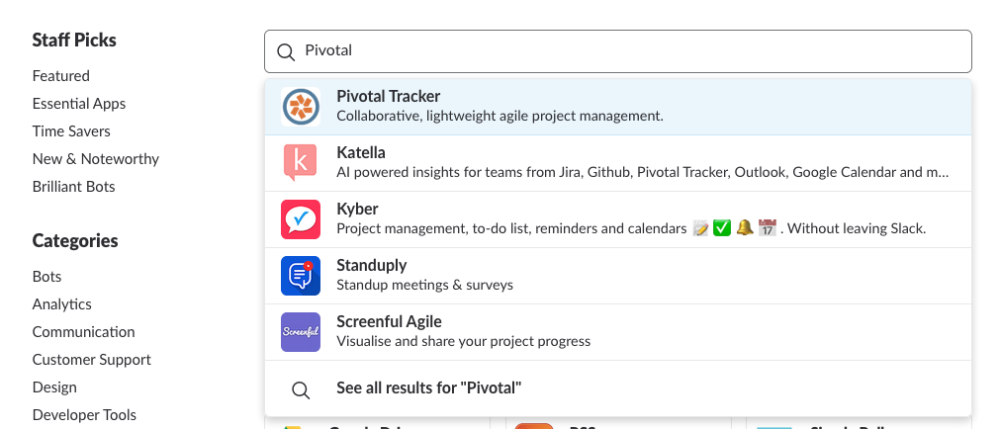

CodeGym Lab Stack: PivotalTracker, Gitlab, SonarQube, Slack
===

*Stack này bao gồm PivotalTracker như công cụ quản lý dự án, Gitlab như công cụ quản lý mã nguồn, SonarQube như công cụ thanh soát mã nguồn, và Slack như kênh giao tiếp.*

Stack này thực hiện những những hoạt động sau:

- Khi dev thực hiện hành động push, mã sẽ được thanh soát bởi SonarQube thông qua Gitlab CI. Kết quả sẽ tự động được đăng vào Slack.
- Khi một commit có message được viết theo quy ước định trước để thông báo về việc issue/feature nào đó sau commit này sẽ đổi trạng thái, issue/feature tương ứng ở pivotal tracker sẽ được tự động đổi trạng thái theo. Kết quả sẽ được tự động đăng vào Slack. Thường thì team sẽ đặt quy ước rằng commit merge branch sẽ được đặt message theo quy ước này.
- Các report được gửi lên SonarQube server sẽ được thông báo vào một chanel xác định trong Slack Workspace
- Các thay đổi trạng thái trên PivotalTracker Project sẽ được thông báo vào một chanel xác định trong Slack Workspace
- Việc tích hợp Gitlab với Slack không được khuyến khích trong Stack này vì sẽ gây ra dư thừa notifications.

I. Tích hợp Gitllab/SonarQube
---

### A. Hướng dẫn dành cho giáo viên

#### 1. Mô tả

SonarQube là một nền tảng thanh soát chất lượng mã nguồn, hoạt động theo mô hình Client/Server. Việc thanh soát diễn ra ở client (máy của học viên, máy Runner của hệ thống CI,...) và báo cáo được gửi lên và kiểm soát tập trung ở SonarQube Server. Chi tiết về kiến trúc này có thể tham khảo tại đường dẫn `https://docs.sonarqube.org/display/SONAR/Architecture+and+Integration`.


Tài liệu này sẽ hướng dẫn dùng Gitlab builtin CI để thực hiện việc thanh soát. Kết quả sẽ được gửi lên một SonarQube Server được xây dựng sẵn.

#### 2. Những bước chuẩn bị chung

##### a. Chuẩn bị SonarQube Server

Chuẩn bị một SonarQube Server là cần thiết trước khi chuyển sang các bước tiếp theo, việc này chỉ cần thực hiện một lần, nếu đã có Server để sử dụng rồi thì có thể bỏ qua.

SonarQube Server sử dụng Elastic Search, nên môi trường chạy nó nên có dư tối thiểu 1GB RAM - khuyến nghị là 2GB. IP của server cần phải có khả năng truy cập được từ cả phía CI Runners lẫn PC của học viên.

SQ Server có thể được cài đặt trọn gói thông qua docker. Sau đây là một cặp file cấu hình docker dựng sẵn, chú ý thay tham số `$PORT` bằng port muốn sử dụng.

```dockerfile
# app.dockerfile
FROM sonarqube:alpine

RUN apk update && apk add jq curl

RUN wget $(curl -s https://api.github.com/repos/kogitant/sonar-slack-notifier-plugin/releases/latest | jq -r ".assets[] | select(.name | test(\"${spruce_type}\")) | .browser_download_url") -P /opt/sonarqube/extensions/plugins/plugins/sonar-slack-notifier-plugin/
```

```yaml
# docker-compose.yml
version: "2"

services:
  sonarqube:
    image: sonarqube:alpine
    ports:
      - $PORT:9000
    networks:
      - sonarnet
    environment:
      - SONARQUBE_JDBC_URL=jdbc:postgresql://db:5432/sonar
    volumes:
      - sonarqube_conf:/opt/sonarqube/conf
      - sonarqube_data:/opt/sonarqube/data
      - sonarqube_extensions:/opt/sonarqube/extensions
      - sonarqube_bundled-plugins:/opt/sonarqube/lib/bundled-plugins

  db:
    image: postgres:alpine
    networks:
      - sonarnet
    environment:
      - POSTGRES_USER=sonar
      - POSTGRES_PASSWORD=sonar
    volumes:
      - postgresql:/var/lib/postgresql
      - postgresql_data:/var/lib/postgresql/data

networks:
  sonarnet:
    driver: bridge

volumes:
  sonarqube_conf:
  sonarqube_data:
  sonarqube_extensions:
  sonarqube_bundled-plugins:
  postgresql:
  postgresql_data:

```

Để sử dụng được, trên host phải có cài đặt sẵn docker executable và docker-compose executable, mở sẵn `$PORT` ở firewall, tạo một thư mục mới với file docker-compose.yml có nội dung như trên. Đứng ở thư mục đó và sử dụng lệnh `docker-compose up -d`  để bật SQ Server.

Xác nhận SQ Server đã được bật và hoạt động ổn định bằng cách vào `http://server-address:$PORT`. Đăng nhập lần đầu tiên với username và password đều là admin.

##### b. Cấu hình permission cho các group user của SonarQube Server

Học viên cũng cần phải có tài khoản ở SQ Server, nếu chưa có, giáo viên hay quản trị viên cần phải tạo tài khoản này.

SQ Server hiện tại không cho phép đặt quyền trên từng user, các quyền được thiết đặt thông qua group, quyền của group được quy định trong các “Permission Template”. Mỗi project có thể được áp một “Permission Template” tại một thời điểm.

Dưới đây là một mẫu thiết đặt cho Default Permission Template. Giáo viên hay quản trị viên có thể tạo nhiều group users để đặt quyền cho học viên trên từng project một.



##### c. Chuẩn bị Gitlab CI Runner

Gitlab CI Runner là những máy tính trực tiếp thực thi các "job" của Gitlab CI - trong stack này thì job đó là thực thi việc thanh soát. Các runner có thể dùng chung cho nhiều repository khác nhau. Một repository có thể được đăng ký sẵn nhiều runner khác nhau để tối ưu lúc chạy job. Cũng như SQ Server, giáo viên hay quản trị viên cần chuẩn bị trước ít nhất một Gitlab CI Runner.

Việc tạo ra một runner cũng có thể thông qua docker. Tạo một thư mục mới cho mỗi runner, đứng ở thư mục đó và chạy câu lệnh như sau, chú ý thay tham số `$RUNNER_NAME` bằng tên của runner, quản trị viên cần quản lý các tên này.

```bash
$ docker run -d --name $RUNNER_NAME \
  -v $PWD:/etc/gitlab-runner \
  -v /var/run/docker.sock:/var/run/docker.sock \
  gitlab/gitlab-runner:alpine
```

Sau khi runner được khởi động lên, một file `config.toml` sẽ được tạo ra trong thư mục hiện hành, nó lưu giữ token của những repository mà runner này đã được đăng ký tới. Quản trị viên có thể backup file này để tái tạo runner khi cần thiết.

#### 3. Chuẩn bị cho mỗi project

##### a. Đăng ký project với SonarQube Server

Với mỗi project của học viên, giáo viên hay quản trị viên cần tạo một project tương ứng trên SQ Server, kết quả của việc này là một cặp key:token. Giáo viên giao cặp key:token này cho học viên để học viên tự cấu hình SonarScanner cho project của mình (học viên sau khi có tài khoản ở SQ Server cũng có thể tự xem token này).

##### b. Tạo tài khoản SonarQube cho học viên

Giáo viên hay quản trị viên cần tạo cho học viên một tài khoản (nếu chưa có), đồng thời đưa tài khoản đó vào group có quyền truy cập project. Sau đó gửi tài khỏan và mật khẩu mặc định cho học viên.

##### c. Đăng ký Gitlab Runner cho repository

Học viên cần gửi registration token của repository của mình về cho quản trị viên hay giáo viên (giáo viên cũng có thể tự vào gitlab để xem).


Token này sẽ được sử dụng để đăng ký runner cho repository. Tại máy tính đang chạy docker container của runner, chạy câu lệnh sau đây, với `$RUNNER_NAME` là tên tùy ý của docker container, và `$TOKEN` bằng giá trị thật:

```bash
docker exec gitlab-runner $RUNNER_NAME register -n \
  --url https://gitlab.com/ \
  --registration-token $TOKEN \
  --executor docker \
  --description "code quality inspection" \
  --docker-image "docker:latest" \
  --docker-privileged
```

Sau khi runner đã được đăng ký, nếu có một commit của học viên được push lên repository ở gitlab mà có tồn tại file cấu hình `.gitlab-ci.yml`, thì  gitlab sẽ gửi request để runner thực thi task được quy định trong file cấu hình đó. Việc còn lại là của học viên: xác nhận rằng một runner đã được đăng ký vào project của mình, và sử dụng SonarQube Token của project để cấu hình tasks cho runner.

### B. Hướng dẫn dành cho học viên

#### 1. Cài đặt SonarQube Scanner

Mặc dù việc thanh soát sẽ được cấu hình để thực hiện tự động, học viên có thể thực thi việc này thủ công bằng cách cài đặt công cụ SonarQube Scanner. Nếu không có nhu cầu, học viên có thể bỏ qua bước này. Việc cài đặt này chỉ cần thực hiện một lần.

SonarQube Scanner là một chương trình viết bằng ngôn ngữ Java, do đó phải xác nhận rằng trên máy tính của học viên đã có Java Runtime Environment được cài đặt thành công (nếu học viên chưa có, download tại đường dẫn `http://www.oracle.com/technetwork/java/javase/downloads/jdk8-downloads-2133151.html`).

Sau khi cài đặt JDK, mở cmd (hoặc một shell session trên linux/unix) và dùng lệnh `java -version` để kiểm tra. Nếu kết quả tương tự như dưới đây thì bạn đã sẵn sàng cho bước tiếp theo: 


Download công cụ SonarQube Scanner tại đường dẫn `https://docs.sonarqube.org/display/SCAN/Analyzing+with+SonarQube+Scanner`. Chọn một thư mục để giải nén vào, tạm gọi là `$INSTALL_DIR`. Ở bước tiếp theo ta cần nạp sonar-scanner vào `PATH` của hệ thống.

##### a. Trên Windows

Mở cửa sổ cấu hình môi trường của Windows theo hướng dẫn trong hình dưới:


Giả sử bạn giải nén file zip thành thư mục `C:\sonar-scanner`. Bấm nút B1 và thêm biến môi trường `SONAR_DIR` như hình dưới:


Kiểm tra ở panel User variables, nếu có sẵn biến môi trường `Path` thì nhấn B3, nếu không có, nhấn B2. Điền thêm giá trị `;%SONAR_DIR%\bin;` (lưu ý dấu chấm phẩy):


Bấm OK trên các hộp thoại. Khởi động lại máy tính, mở cmd và chạy thử câu lệnh sau để xác nhận rằng `sonar-scanner` đã có thể hoạt động (kết quả thực thi thường là `FAILED`, nhưng ít nhất nó xác nhận rằng bạn đã đưa `sonar-scanner` vào môi trường của hệ thống thành công):


##### b. Trên Linux/Unix

Trên macos, mở terminal, nhập câu lệnh `open -e ~/.bashrc`, hoặc trên một linux’s distro, mở terminal và sử dụng `nano ~/.bashrc`, để mở file `.bashrc`, nếu không có file đó, sử dụng file `.profile` thay thế.

Thêm dòng sau vào cuối file và lưu lại, chú ý thay phần chữ in đậm bằng đường dẫn tới thư mục giải nén thật:

```
export PATH="$PATH:"sonar-scanner-macosx/bin"
```

Khởi động lại máy tính, mở terminal và chạy thử câu lệnh sau để xác nhận rằng sonar-scanner đã có thể hoạt động (kết quả thực thi thường là `FAILED`, nhưng ít nhất nó xác nhận rằng bạn đã đưa sonar-scanner vào môi trường của hệ thống thành công):


#### 2. Gửi Gitlab Repository CI Token cho giáo viên/quản trị viên để đăng ký CI Runner

Với stack này, việc chạy sonarqube scanner được thực hiện tự động bởi Gitlab CI Runner. Để đăng ký gitlab repository với một runner, giáo viên/quản trị viên cần có mã token được tạo ra bởi gitlab. Học viên có thể truy cập panel như dưới đây để lấy mã này và gửi cho giáo viên/quản trị viên:


##### a. Đặc tả nhiệm vụ cho Gitlab CI Runner

Ta cần đặc tả để CI Runner sẽ thực thi sonar-scanner. Ở thư mục gốc của project, tạo file `.gitlab-ci.yml` với nội dung như sau:

```yaml
qualitycheck:
  image: docker:latest
  variables:
    DOCKER_DRIVER: overlay
  services:
    - docker:dind
  script:
    - docker pull binhsonnguyen/sonarqube-scanner
    - docker run -v $PWD:/root/src binhsonnguyen/sonarqube-scanner
```

Giáo viên/quản trị viên sẽ giúp các bạn đính một runner vào repository ở gitlab.com. Runner đó sẽ chạy hai tác vụ được mô tả ở mục script, trong đó tác vụ thứ hai là sử dụng sonar-scanner để thanh soát mã trên project của bạn (theo đặc tả được bạn mô tả ở bước trước).

##### b. Cấu hình SonarQube Scanner

Để bất cứ instance nào của sonarscanner (dù ở môi trường của học viên hay ở trong runner) cũng đều cần có đặc tả về project để thực hiện được nhiệm vụ của nó. Sau đây là các bước tạo ra đặc tả này:

__Nhận project token__

Học viên sẽ nhận project Token từ giáo viên/quản trị viên, hoặc sau khi học viên có tài khoản có quyền hạn trên SonarQube Server, học viên có thể tự truy cập project để lấy Token.

__Đặc tả project cho SonarQube Scanner__

Ở bước này, ta viết file cấu hình để chỉ dẫn cho sonar-scanner thanh soát project. Ở thư mục gốc của project, tạo file sonar-project.properties với nội dung như sau (chú ý thay phần chữ in đậm bằng các giá trị thật):

```text
# key và token được giáo viên cung cấp, hoặc xem trên SonarQube Server
sonar.projectKey=$TOKEN_NAME:$TOKEN_KEY
# tên, và version sẽ được hiện lên trên SonarQube Server
sonar.projectName=$PROJECT_NAME
sonar.projectVersion=$PROJECT_VERSION

# địa chỉ của SonarQube Server
sonar.host.url=http://$SONARQUBE_SERVER_ADDRESS:$PORT

# Chỉ định đường dẫn thư mục source code. Thay "\" bằng "/" trên Windows.
sonar.sources=$SOURCE_CODE_LOCATION

# chỉ định ngôn ngữ
sonar.language=$LANGUAGE
# nếu cần, bỏ comment dòng sau và chỉ định encoding
#sonar.sourceEncoding=UTF-8

# comment lại nếu không có phpunit trong project
sonar.php.coverage.reportPath=ci/codeCoverage/codeCoverage.xml
sonar.php.tests.reportPath=ci/testResults.xml

# comment lại nếu không phải là project laravel
sonar.exclusions=app/Providers/**
```

Nếu bạn chạy sonar-scanner một cách thủ công, thì một thư mục tên `ci` sẽ tự động được tạo ra. Có thể liệt kê thư mục đó vào file .gitignore.

II. Tích hợp Gitlab/PivotalTracker
---

Mục này hướng dẫn cách để Gitlab webhook có thể comment và chuyển trạng thái của các issue/feature/story đang được đăng trên PivotalTracker.

### A. Hướng dẫn dành cho giáo viên

Gitlab cần được một tài khoản thật của PivotalTracker mà có quyền hạn trên issue/feature/story tương ứng. Việc này được thực hiện bằng cách trao API Token của tài khoản PivotalTracker cho Gitlab webhook.

Sau đây là cách thực hiện.

#### 1. Lấy API Token của tài khoản PivotalTracker

Lưu ý: việc trao token này cho Gitlab sẽ làm cho Gitlab Webhook có toàn quyền trên những issue/feature/story mà tài khoản PivotalTracker này có quyền hạn. Do đó, hành dụng ưu việt nhất là tạo một tài khoản PivotalTracker chỉ có quyền hạn trên một project duy nhất, và sử dụng API Token của tài khoản đó.

Token API của PivotalTracker có thể được truy cập ở mục profile: `https://www.pivotaltracker.com/profile`


#### 2. Khai báo Token API cho PivotalTracker Gitlab Webhook

Tạo ra PivotalTracker Webhook bằng cách vào Project Settings ở Gitlab:


Nhập API Token vào cho Webhook và active Webhook lên. Mặc định cho Webhook lắng nghe trên tất cả các branch:


Nhấn Test & Save để xác nhận rằng Webhook đã hoạt động.

### B. Hướng dẫn dành cho học viên

PivotalTracker Webhook sẽ tự động trigger mỗi khi có thao tác push được thực hiện. 
Nếu có một commit có message tuân thủ cú pháp `"<nội dung bất kỳ>[#TRACKER_STORY_ID]"` được push lên, Webhook sẽ tự động post commit đó lên activity của issue/featute/story có ID `#TRACKER_STORY_ID`.

Ví dụ, với story như sau:


Commit có message như sau đây đã được log lên activities:


Nếu có một commit có message tuân thủ cú pháp `"<nội dung bất kỳ>[(Finishes|Fixes|Delivers) #TRACKER_STORY_ID]"` được push lên, Webhook sẽ tự động chuyển issue/feature/story có id là `#TRACKER_STORY_ID` sang trạng thái kế tiếp của `Finishes|Fixes|Delivers`.

Ví dụ, với story trên, commit có nội dung như sau:


...sẽ đưa issue sang trạng thái kế tiếp của trạng thái Finishes:


Lưu ý: đối với PivotalTracker, trạng thái của issue/feature/story chỉ có ý nghĩa khi issue/featue/story đó đã được “Start”. Luật tương tự cũng được áp dụng cho Webhook. Do đó, các message mang `#TRACKER_STORY_ID` chỉ có ý nghĩa trên những story đã được Started.

III. Tích hợp SonarQube/Slack
---

Mục này hướng dẫn tích hợp, để SonarQube Server gửi thông báo tới một chanel định trước trong workspace Slack.

SonarQube Server cần phải được cài đặt một plugin dành cho việc này. Việc cài đặt đã được cấu hình sẵn vào ảnh docker.

Các  bước để tích hợp bao gồm tạo ra một webhook cho workspace Slack. Và thông báo đường dẫn webhook này, cùng với các thông tin về SonarQube project, user alias, chanel… cho SonarQube Plugin.

### A. Tạo Slack Incoming Webhook Integration

Mục này hướng dẫn tạo một Incoming Webhook của một Slack Workspace. Nhờ đó các dịch vụ bên thứ ba của thể sử dụng URL của webhook này để post các notifications tới một chanel cụ thể trong Slack Workspace.

#### 1. Trước khi cài đặt

Cần chuẩn bị trước một chanel để các dịch vụ bên thứ ba sẽ gửi notifications tới.

#### 2. Tạo Incoming Webhook

Vào trang customize của Slack Workspace, truy cập vào thư viện Apps của Slack bằng cách nhấn button “Browse”:


Tại màn hình Apps, tìm tới app _Incoming Webhooks_:


Danh sách các webhooks đang hoạt động sẽ hiện ra, để tạo một webhooks mới, nhấn “Add Configuration”:


Chỉ định chanel mà webhook này sẽ hoạt động:


Sau khi submit, lấy URL đã được tạo ra để mang đi cấu hình cho dịch vụ của bên thứ ba:


Lưu ý: tại thời điểm viết tài liệu này, Slack Incoming Webhook được tạo ra cho một chanel xác định, nhưng các dịch vụ bên thứ ba lại vẫn có thể dùng URL của webhook đó để post lên bất kỳ chanel nào của workspace Slack (tùy thuộc vào việc dịch vụ đó có làm thế, và có cho phép người dùng cấu hình chanel hay không). Trong tương lai điều này có thể thay đổi.

#### 3. Tùy chỉnh hiển thị

Ít nhất nên tùy chỉnh tên hiển thị cho webhook này để dễ quản lý, có thể tùy chỉnh cả ảnh avatar sẽ được dùng cho notifications từ dịch vụ bên thứ ba:


Tham khảo thêm về imcoming webhooks tại `https://api.slack.com/incoming-webhooks/`

### B. Cấu hình để SonarQube Plugin sử dụng Incoming Webhook

Đăng nhập SonarQube Server bằng tài khoản có quyền admin, mở panel “Administration/Configuration/General”, xác nhận rằng cấu hình `Base URL` đã được thiết đặt (ví dụ: `https://sonarqube.codegym.vn`):


Mở panel “Administration/Configuration/Slack”, enable plugin, nhập Slack Incoming Webhook URL, alias cho user sẽ post notifications, cấu hình Slack Chanel sẽ dùng để post notifications cho các project tương ứng (theo project key), lưu thiết lập lại:


Kết quả của việc cấu hình này là một notifications sẽ được post lên chanel đã được cấu hình, mỗi khi sonar-scanner thực hiện thành công một lần scan:


IV. Tích hợp PivotalTracker/Slack
---

Mục này hướng dẫn tích hợp PivotalTracker với Slack, để PivotalTracker tự động post các sự kiện trên một project xác định vào một chanel xác định trong Slack Workspace.

Các bước thực hiện bao gồm cài đặt app “Pivotal Tracker” vào Slack Workspace, và lấy Webhook URL được cung cấp để khai báo vào cài đặt webhook của project ở PivotalTracker.

### A. Cài đặt app “Pivotal Tracker” vào Slack Workspace

Vào trang customize của Slack Workspace, truy cập vào thư viện Apps của Slack bằng cách nhấn button “Browse”:


Tại màn hình Apps, tìm tới app Pivotal Tracker:



Danh sách các PivotalTracker integrations đang hoạt động sẽ hiện ra, nếu muốn tạo một integration mới, nhấn “Add Configuration”:


Chỉ định chanel mà các notifications sẽ được post vào:


Chỉ định tên và ảnh hiển thi cho các post của integration này:


Lấy Webhook URL và sang bước tiếp theo:


### B. Khai báo Webhook URL cho PivotalTracker Project

Tại PivotalTracker, vào project Settings/Webhook, nhập Webhook URL đã có ở bước trước vào, chỉ định API v5, và nhấn lưu:


Kết quả của việc này là một message sẽ được post lên chanel chỉ định mỗi khi có sự thay đổi trạng thái trên PivotalTracker Project:


